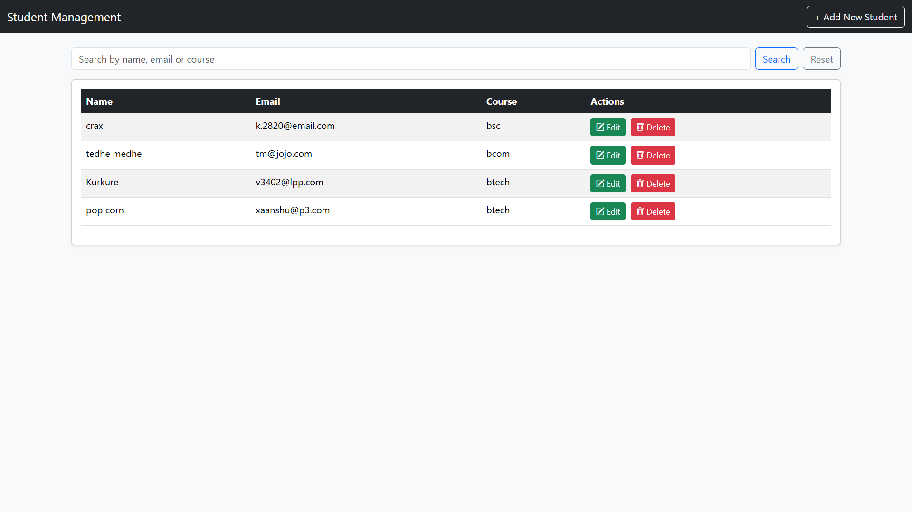
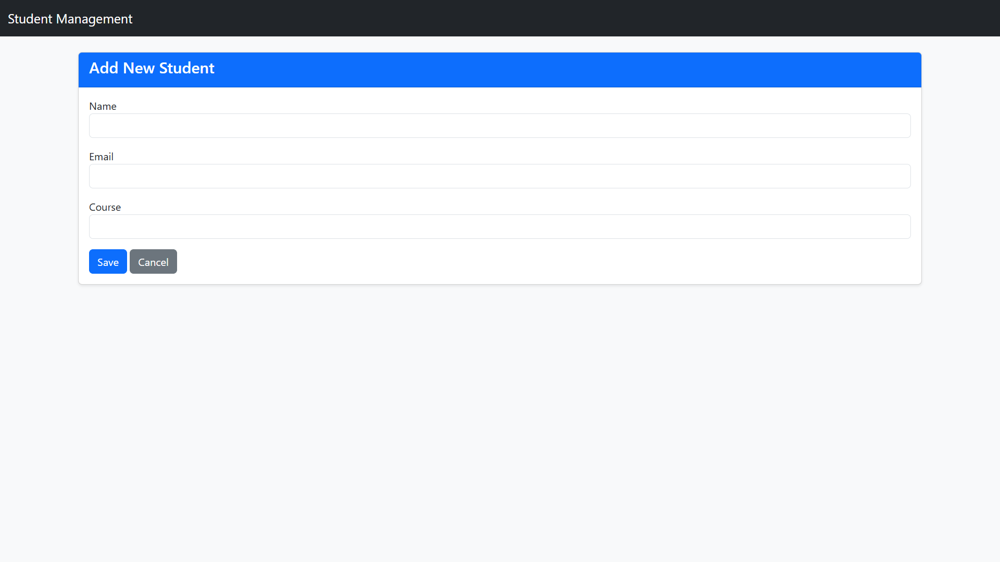
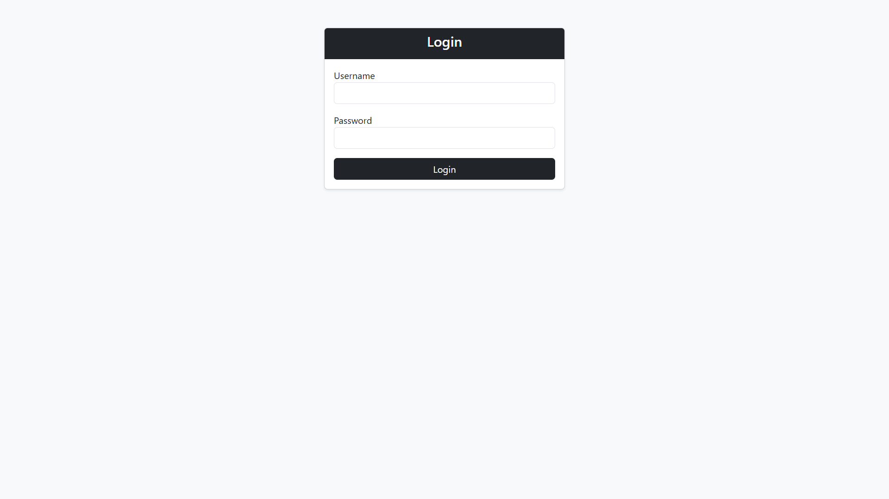
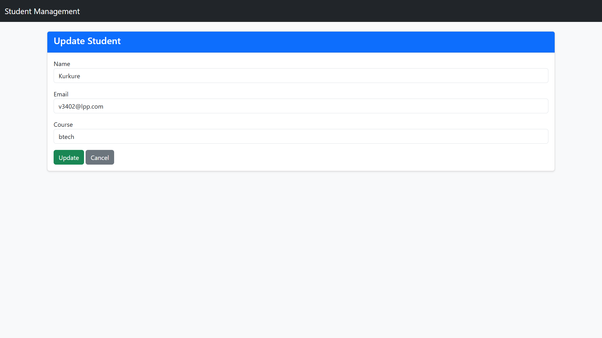

# 🎓 Student Management System (Spring Boot + Thymeleaf + MySQL)

A full-stack web application to manage student information with login authentication, search, sort, and CRUD functionalities. Built using *Spring Boot, **Spring Security, **Thymeleaf, and **MySQL* with a responsive Bootstrap UI.

---

## 🚀 Features

- 🔐 Secure login with Spring Security
- ➕ Add new students
- ✏ Edit and update student records
- ❌ Delete student entries
- 🔍 Search students by name, email, or course
- ↕ Sort table by any column
- 💻 Responsive and modern UI with Bootstrap
- 🎨 Clean and aesthetic design

---

## 🖼 Screenshots

| Home Page                             | Add Student Page                         |
|---------------------------------------|------------------------------------------|
|                |                 |

| Login Page                            | Update Student Page                      |
|---------------------------------------|------------------------------------------|
|               |                 |

---

## 🛠 Tech Stack

| Layer       | Technology                     |
|-------------|--------------------------------|
| Frontend    | Thymeleaf, HTML, Bootstrap 5   |
| Backend     | Spring Boot, Spring Security   |
| Database    | MySQL, Spring Data JPA         |
| Build Tool  | Maven                          |

---

## 🧑‍💻 Getting Started

### 📁 Clone the Repository
```bash
git clone https://github.com/neha-maurya-28/Student-Management-System.git
```
```bash
cd student-management
```
### ▶ Run the App

1. Make sure MySQL is running and database student_db is created.
2. Update src/main/resources/application.properties with your DB credentials.
3. Build and run the project:

```bash
./mvnw spring-boot:run
```
